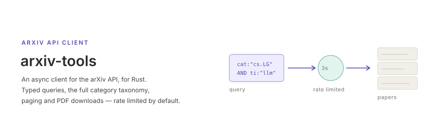

<p align="center"></p>

[English](README.md) | **日本語**


# arxiv-tools

[arXiv API](https://info.arxiv.org/help/api/) の非同期 Rust クライアントです．
検索条件を型付きの式ツリーとして組み立てると，パース済みの論文が返ってきます．
演算子の優先順位，パーセントエンコーディング，ページング，リトライ，そして
arXiv の利用規約が求める 3 秒間隔といった，間違えやすい部分はクライアント側が
引き受けます．

- すべての検索フィールドと論理演算子を網羅した型付きクエリビルダ
- arXiv の全カテゴリ分類 — 155 コードすべて．今後追加されるコードにも対応
- フィード自身が返す件数に基づくページング
- ストリーミング保存と検証つきの PDF ダウンロード
- 既定でレート制限・リトライ対応・メモリ上限つき

## インストール

```bash
cargo add arxiv-tools
```

## クイックスタート

```rust
use arxiv_tools::{ArXiv, Category, QueryParams};

#[tokio::main]
async fn main() -> Result<(), arxiv_tools::Error> {
    let papers = ArXiv::from_args(QueryParams::and(vec![
        QueryParams::title("large language model"),
        QueryParams::subject_category(Category::CsLg),
    ]))
    .max_results(10)
    .query()
    .await?;

    for paper in &papers {
        println!("{} ({})", paper.title, paper.arxiv_id());
    }
    Ok(())
}
```

## ドキュメント

- [使い方](docs/usage.ja.md) — 検索，クエリの組み立て，カテゴリ，ページング，PDF，エラー
- [クライアントの設定](docs/client.ja.md) — レート制限，タイムアウト，リトライ，レスポンス上限
- [1.x からの移行](docs/migration.ja.md) — 2.0 の変更点と，コンパイラが検出しない差分
- [API リファレンス](https://docs.rs/arxiv-tools)（docs.rs）
- [変更履歴](CHANGELOG.md)

対応する最小の Rust バージョン: 1.85．

## ライセンス

Apache-2.0．[LICENSE](LICENSE) を参照してください．
