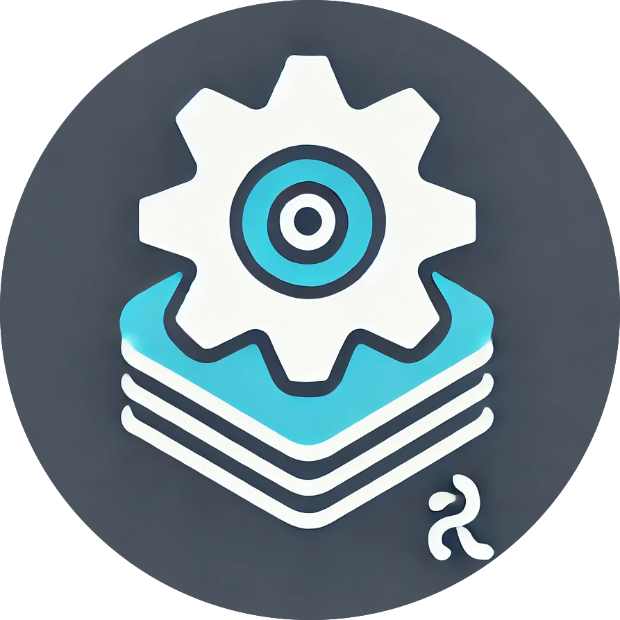

# rs-arxiv-tools

Tools for arXiv API.



## Quick Start

### Installation

To start using `arxiv-tools`, just add it to your project's dependencies in the `Cargo.toml`.

```bash
> cargo add arxiv-tools
```

Then, import it in your program.

```rust
use arxiv_tools::ArXiv;
```

### Usage

#### Search by Title

```rust
use arxiv_tools::{ArXiv, QueryParams};

#[tokio::main]
async fn main() {
    let mut arxiv = ArXiv::from_args(QueryParams::title("attention is all you need"));
    let papers = arxiv.query().await;
    println!("{:?}", papers.first().unwrap().title);
}
```

#### Fetch by arXiv ID

```rust
use arxiv_tools::ArXiv;

#[tokio::main]
async fn main() {
    // Fetch specific papers by their arXiv IDs
    let mut arxiv = ArXiv::from_id_list(vec!["1706.03762", "1810.04805"]);
    let papers = arxiv.query().await;
    for paper in papers {
        println!("{}: {}", paper.id, paper.title);
    }
}
```

See the [Documents](https://docs.rs/arxiv-tools/latest/arxiv_tools/index.html) for more details.

# Release Notes

<details open>
<summary>1.2.0</summary>

- Added `id_list` support for querying papers by arXiv IDs.
- Added `ArXiv::from_id_list()` constructor.
- Added `ArXiv::id_list()` method.
- Fixed API endpoint to use HTTPS.

</details>

<details>
<summary>1.1.2</summary>

- Fixed a bug: fixed the query parameter `submittedDate`.

</details>

<details>
<summary>1.1.0</summary>

- Added optional parameters such as `start`, `max_results`, `sortBy`, `sortOrder`.
- Updated documents.

</details>
